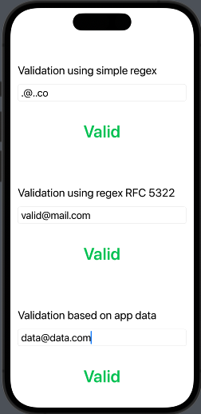
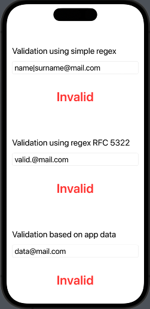

# SwiftUI-Samples

### About

Simple SwiftUI projects as samples and examples. See projects files in `Projects` folder.

## Navigate

- [Simple Login Screen](#simple-login-screen)
- [TabView Content](#tabview-content)
- [Email Validation](#email-validation)

## Simple Login Screen

|Screen Example|
|:-:|
||

### Logic

> Simple logic is behind the screen. No hardcoded accounts or mock data. 
> Implemented 2 screens with Login option and navigation to further main screen of application. 
> As a parameter for the main screen is username as String.

## TabView Content
|News Example|Account Example|Tickets Example|
|:-:|:-:|:-:|
||||

### Logic 

> Implemented 5 different tabs for single TabView. 
> Collection of the data is based on hardcoded values inside the model structs (without mock or real Api calls). 
> Implemented QR code scanner screen with some fake result instead of real verification. Account and Tickets data are taken from the same source. 
> Logout screen is implemented with discard BarView from the Navigation stack and return to Initial screen. 
> Base tab for TabView is the first one that is defined in the code.

## Email Validation
|Empty Data|Valid Data|Invalid Data|
|:-:|:-:|:-:|
||||

### Logic 

> Implemented 3 types of email validation.  
> 1st type of validation is based on simple regex that excludes few special symbols and define length.  
> 2nd type of validation is based on RFC 5322 regex that excludes most of the invalid types of email.  
> 3rd type of validation is based on pre-saved emails and validate identical match.  
> Pre-saved emails in the app are fake hardcoded data (no integration with 3rd party storage).  