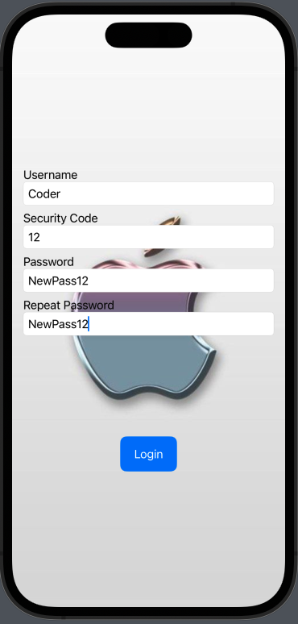

# SwiftUI-Samples

### About

Simple SwiftUI projects as samples and examples. See projects files in `Projects` folder.

## Navigate

- [Simple Login Screen](#simple-login-screen)

## Simple Login Screen

#### Logic

> Simple logic is behind the screen. No hardcoded accounts or mock data. Implemented 2 screens with Login option and navigation to further main screen of application. As a parameter for the main screen is username as String.