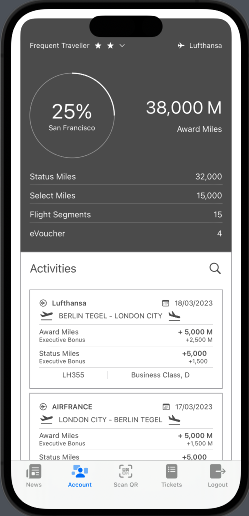
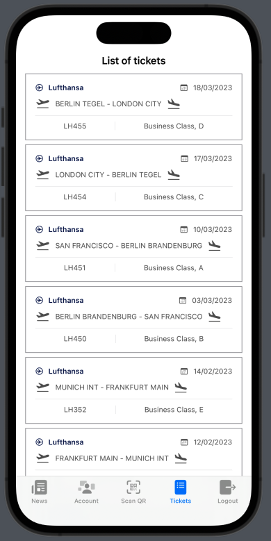

# SwiftUI-Samples

### About

Simple SwiftUI projects as samples and examples. See projects files in `Projects` folder.

## Navigate

- [Simple Login Screen](#simple-login-screen)
- [TabView Content](#tabview-content)
- [Email Validation](#email-validation)
- [Splash Screens](#splash-screens)
- [Location Manager](#location-manager)

## Simple Login Screen

|Screen Example|
|:-:|
||

### Logic

> Simple logic is behind the screen. No hardcoded accounts or mock data. 
> Implemented 2 screens with Login option and navigation to further main screen of application. 
> As a parameter for the main screen is username as String.

## TabView Content
|News Example|Account Example|Tickets Example|
|:-:|:-:|:-:|
||||

### Logic 

> Implemented 5 different tabs for single TabView. 
> Collection of the data is based on hardcoded values inside the model structs (without mock or real Api calls). 
> Implemented QR code scanner screen with some fake result instead of real verification. Account and Tickets data are taken from the same source. 
> Logout screen is implemented with discard BarView from the Navigation stack and return to Initial screen. 
> Base tab for TabView is the first one that is defined in the code.

## Email Validation
|Empty Data|Valid Data|Invalid Data|
|:-:|:-:|:-:|
||||

### Logic 

> Implemented 3 types of email validation.  
> 1st type of validation is based on simple regex that excludes few special symbols and define length.  
> 2nd type of validation is based on RFC 5322 regex that excludes most of the invalid types of email.  
> 3rd type of validation is based on pre-saved emails and validate identical match.  
> Pre-saved emails in the app are fake hardcoded data (no integration with 3rd party storage).  

## Splash Screens
|List of Screens|Timer Splash|Opacity Splash|Rotation Splash|
|:-:|:-:|:-:|:-:|
|||||

### Logic 

> Implemented 6 types of Splash Screen.  
> Any of the Splash screen example might be possible to choose via List of Splash Screens.  
> 1st type of Splash Screen is based on timer and base image on the screen. After timer time expiration performed auto navigation to the another screen. But in current implementation is implemented navigation back to the list screen  
> 2nd type of plash Screen is based on Text appearing from the first and then after time (with timer) button with Login option. Login buttons navigates to the another screen (defined as returning to the list of Screens)  
> 3rd type of Splash Screen is based on permanent text and scaling Image from invisible (very small image) to the big image during some defined time.  
> 4th type of Splash Screen is based on permanent text and Image that appears from the invisible (opacity = 0) to the full visibility (opacity = 1) during some defined time.  
> 5th type of Splash Screen is based on permanent text and rotation Image that performs rotation during some defined time.  
> 6th type of Splash Screen is based on permanent text and moving Image by some defined path on the screen during some defined time. Additionally this screen contains Gradient background color.  

## Location Manager
|Location on Single Request|Location on Permanent Request|
|:-:|:-:|
|||

### Logic 

> Implemented 3 types of Location fetching Screens.  
> The main issue with getting Location for the device is background location service since iOS 16.3.  
> Apple was implemented more secured for end user usage of location service. <\br>
> Previous approach does not work after iOS 16.3 release. <\br>
> This application contains 3 tabs with different implementation of the Location Manager and setting for it. <\br>
> The first screen is based on single request to get data about device location <\br>
> The second screen is based on permanent data getting of device location with fixed version of background work of Location Manager. <\br>
> The third screen is based on the permanent data getting of device location and default implementation of Location Manager. <\br>
> All screens record data to Core Data and have options through "Clear History" button to delete all data about location. <\br>
> For permanent data request app contains 2 options to start data getting and stop data getting. <\br>
> All data that was recorded to the Core Data will be displayed on the list in the same screen. <\br>
> For each type of the screen data is recorded separately and deleted separately. <\br>
> Recorded data contains time and date of the record creation and information about device location in format (la: lo:). <\br>
> Screen recording was made on iPad and view more adopted to the iPad screen size and resolution. <\br>